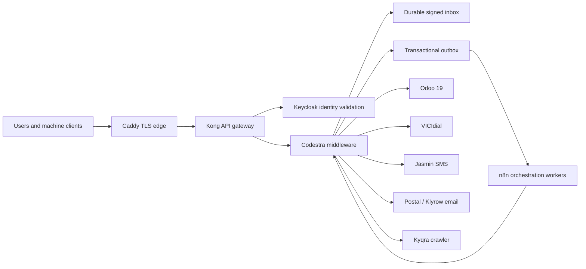

# Architecture

## Control plane

## Trust boundaries

### Public edge

Caddy terminates public TLS. Kong enforces route-specific authentication, rate limits, allowlists, and machine identity mapping. Public callbacks must not terminate directly at n8n.

### Middleware boundary

Middleware is the only component allowed to translate automation intent into service-specific commands. It owns:

- tenant and actor authorization
- idempotency and optimistic concurrency
- timestamped HMAC verification and replay protection
- suppression, consent, privacy deletion, and retention rules
- per-integration pause controls and the global external-delivery kill switch
- durable inbox/outbox state, retries, dead-letter handling, and audit records

### n8n boundary

n8n coordinates approved sequences. It does not own authorization, canonical business state, credentials for direct database access, or policy decisions. Workflow exports are inactive in Git and may reference only `MIDDLEWARE_BASE_URL` for outbound HTTP.

## Data ownership

| Domain | System of record | n8n role |
|---|---|---|
| Identity and machine clients | Keycloak / middleware identity map | consume scoped identity context |
| CRM records | Odoo through middleware | orchestrate approved commands |
| Calls and dispositions | VICIdial plus middleware audit | schedule and reconcile |
| SMS delivery | Jasmin through middleware | sequence approved sends |
| Email delivery | Postal/Klyrow through middleware | sequence approved sends |
| Crawl jobs and results | Kyqra through middleware | schedule and reconcile |
| Delivery state | middleware inbox/outbox | monitor, retry only through governed APIs |
| Workflow definitions | this repository | reviewed source of truth |

## Isolation

Every command carries tenant, correlation, event, and idempotency identifiers. Batch jobs must preserve per-company isolation: one company failure cannot roll back, unlock, or replay another company without an explicit operator action.
